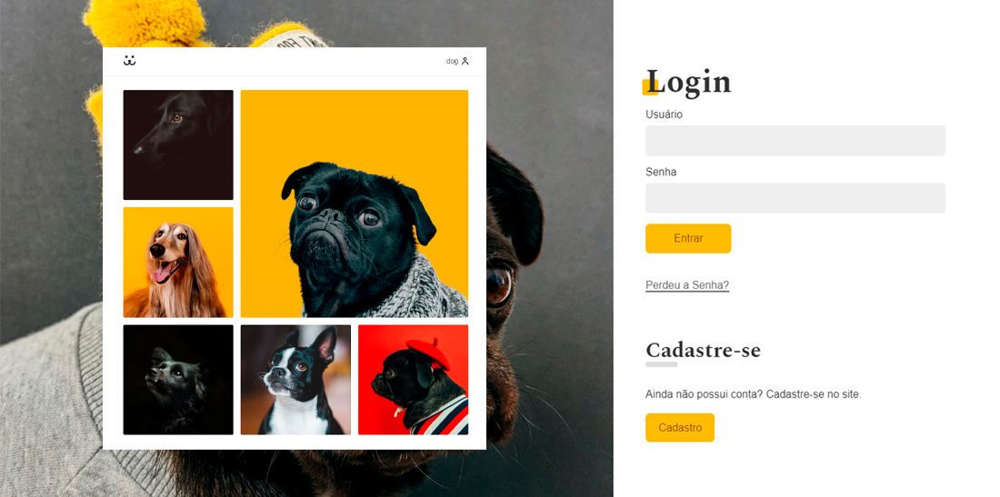

# 🦴 Dogs

  

## Descrição do projeto

Projeto de rede social para cachorros.

## 🚀 Tecnologias

- Vite
- ReactJS
- React Router Dom
- Consumo de API REST

## ⚙️ Instalação

### Clone o projeto

git clone https://github.com/ViniGSouza/dogs-social.git

### Instale as dependências digitando no termimal

yarn

### Rode a aplicação.

yarn dev

---

Feito por mim.
